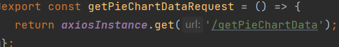
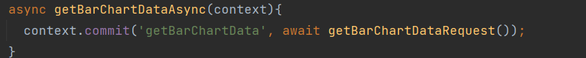
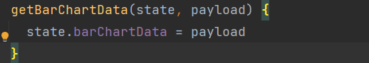
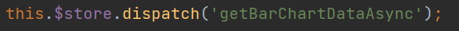
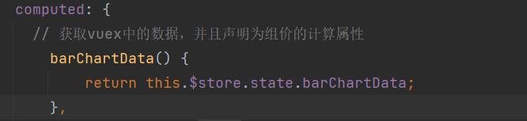
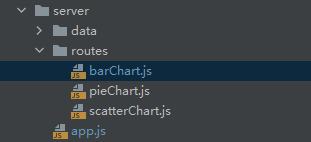
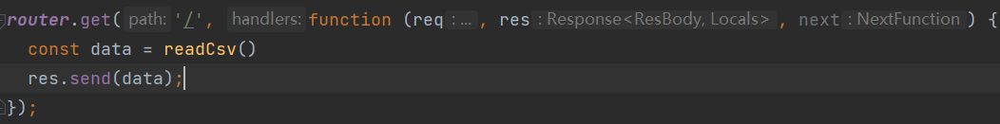
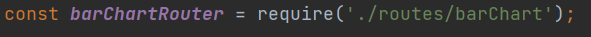
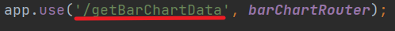

## 模板项目启动

```
# 1.首先进入项目
cd project
# 2. 安装依赖
npm i or yarn install
# 3.启动后台
node server/app.js
# 4.启动前端
npm run serve or yarn serve

# ！！！注意 yarn和npm命令只能使用一个，不能混合使用，混合使用可能会出现一些奇怪的bug
```

## 模板项目的基本结构

```
├── README.md
├── babel.config.js
├── .prettierrc.js #prettierrc格式化的配置
├── package-lock.json
├── package.json
├── public
│   ├── favicon.ico
│   └── index.html
├── server #后端主目录
│   ├── app.js #后端入口文件
│   ├── routes #后端路由管理
│   │   ├── pieChart.js #某块业务的路由
│   │   └── scatterChart.js #某块业务的路由
│   └── utils #后端功能函数
└── src #前端主目录
    ├── App.vue #项目根组件
    ├── api #存放发送请求
    │   ├── config.js #配置axios
    │   ├── pieChartApi.js #具体图表的某个请求
    │   └── scatterChartApi.js #具体图表的某个请求
    ├── assets #存放图标等一些文件
    │   └── logo.png
    ├── components #存放具体的组件
    │   ├── PieChart #单个具体的组件
    │   │   ├── pieChart.css #这个组件的样式
    │   │   ├── pieChart.vue #编写具体的组件信息
    │   │   └── statusLine.js #这个组件的功能函数
    │   └── ScatterChart
    │       ├── scatterChart.css
    │       ├── scatterChart.vue
    │       └── scatterChartHelp.js
    ├── main.js #前端主文件
    ├── router  #前端路由，配置跳转页
    │   └── index.js
    ├── store   #vuex
    │   ├── actions.js  #存放异步的action
    │   ├── index.js
    │   └── mutations.js #同步修改state
    ├── utils #项目的通用功能函数
    |   └──js公共的js文件
    |   └──css公共的样式文件
    │   └── hlep.js
    └── views #视图组件
        ├── Home.css #样式处理
        └── Home.vue #对所有的子组件进行布局
```
1. api 请求函数全部放在 api 文件夹中
2. 状态全部放在 store 中进行管理
3. 请求数据的代码可以放在 mutations 中
4. 每个组件独享的函数可以放在组件下面的 xxxHelp.Js 文件中
5. 通用型的函数可以放在 utils 中
6. 布局全部放在 Layout.vue 中进行处理如下
   ```html
   <div class="layout">
     <div class="top">
       <PieChart msg="PieChart" :pieChartData="pieChartData" />
       <div class="left">
         <ScatterChart msg="PieChart" :scatterChartData="scatterChartData" />
       </div>
       <div class="bottom">xxxx</div>
     </div>
     <style scoped>
       .layout {
       }
       .top {
       }
       .left {
       }
       .bottom {
       }
     </style>
   </div>
   ```
## 代码命名规范
1. JS 文件命名： 小驼峰法 如 pieChartHelp 第一个单词小写,其他单词首字母大写
2. Components 文件命名： 大驼峰法 如 PieChart 所有单词首字母大写
3. 常量一般全部大写，每个单词使用分隔符隔开，比如
   `const BASE_URL = 'http://localhost:3000/';`
4. 变量使用小驼峰命名法。

## prettier配置
加入了prettier配置（`.prettierrc.js`）,使用prettier格式化文件，例如使用
`npx prettier --write src/views/Home.vue` 可以格式化Home.vue这个文件。

注意`src/views/Home.vue`这个是文件的路径，主要看你执行该命令所在的目录，如果是你在`src/views`这个目录下执行格式化命令的话，应该这么写 `npx prettier --write Home.vue`

这样格式化文件可能很麻烦，每次都需要运行命令。但是可以下载vscode插件（`Prettier - Code formatter`
）配置来解决。

下面这个网址是`prettier`一个简单的教程很有用可以看看

文字教程:  [https://juejin.cn/post/6990929456382607374](https://juejin.cn/post/6990929456382607374)

视频教程：  [https://www.bilibili.com/video/BV183411r7YK?from=search&seid=5236192765464508070](https://www.bilibili.com/video/BV183411r7YK?from=search&seid=5236192765464508070)

下面的网址是配置`prettierrc.js`的[官网](https://prettier.io/docs/en/options.html?spm=a2c4e.11153940.blogcont422690.11.5d0b5721zZ3CkZ)

## vue单页面改为多页面
主要是配置webpack。 下面的链接是把vue单页面改为多页面的教程。https://www.jianshu.com/p/eceb2ac9df90


# 前后端

## 前端发送请求和接收数据

以barChart组件为例：


1. 在api目录下创建一个js文件：该文件下编写请求后端接口的函数




2. 写好请求函数后，将该函数封装到vuex中统一管理接口

   

   在action中封装并调用



​		在mutations.js中将获得的数据赋值到vuex变量中



3. 最后在对应的组件调用封装的函数，以及获取数据





## 后端接收请求返回数据

项目模板的后端在server目录下：



1. 首先在routes目录下编写对应组件的路由（请求对应的处理函数）

   

2. 在app.js中将该路由引入

   

3. 设置请求路由



前端通过请求该路由后，后端接收到请求，开始调用该路由的数据处理函数。并将处理结果返回给前端


# Flex布局

详细：https://www.runoob.com/w3cnote/flex-grammar.html